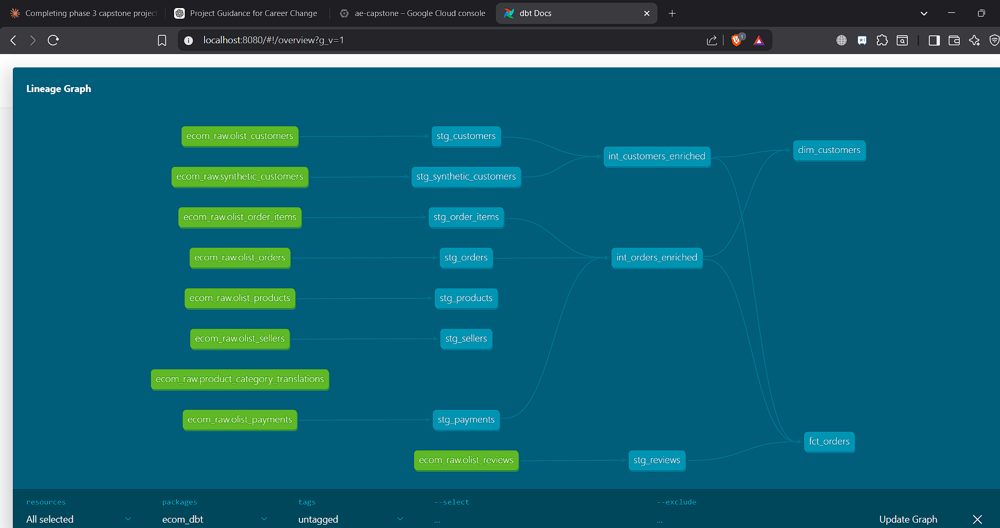

# 🛒 E-Commerce Analytics Engineering Capstone

A full analytics engineering project built on the Brazilian Olist e-commerce dataset using dbt Cloud and Google BigQuery. Implements a production-style dimensional model with staging, intermediate, and mart layers — demonstrating the complete analytics engineering workflow on a cloud data warehouse.

---

## Business Problem

E-commerce businesses need reliable, business-ready data to answer questions like:
- What is the order fulfilment rate and average delivery time?
- Which product categories drive the most revenue?
- How do customer segments differ by purchase behaviour?
- What is the relationship between review scores and order value?

This project models raw transactional data from 8 source tables into a clean dimensional model that answers these questions reliably.

---

## Architecture

```
Google Cloud Storage (raw CSV files)
          │
          ▼
BigQuery — ecom_raw dataset (8 source tables)
          │
          ▼
dbt Cloud — Staging Layer
(stg_customers, stg_orders, stg_order_items,
 stg_products, stg_sellers, stg_payments,
 stg_reviews, stg_synthetic_customers)
          │
          ▼
dbt Cloud — Intermediate Layer
(int_customers_enriched, int_orders_enriched)
          │
          ▼
dbt Cloud — Marts Layer
(dim_customers, fct_orders)
```

---

## Tech Stack

| Tool | Purpose |
|---|---|
| Google BigQuery | Cloud data warehouse |
| dbt Cloud | Transformation, documentation, lineage |
| Google Cloud Platform | Infrastructure (GCS, IAM, service accounts) |
| GitHub | Version control, dbt Cloud integration |
| SQL | All transformations |

---

## Dataset

**Source:** Brazilian E-Commerce Public Dataset by Olist (Kaggle)

| Table | Description | Rows (approx) |
|---|---|---|
| olist_customers | Customer profiles and locations | 99,441 |
| olist_orders | Order status and timestamps | 99,441 |
| olist_order_items | Products within each order | 112,650 |
| olist_products | Product catalogue | 32,951 |
| olist_sellers | Seller profiles | 3,095 |
| olist_payments | Payment methods and values | 103,886 |
| olist_reviews | Customer review scores | 99,224 |
| product_category_translations | Category name translations | 71 |

---

## dbt Model Layers

### Staging Models (raw → clean)
| Model | Source Table | Key Transformations |
|---|---|---|
| `stg_customers` | olist_customers | Type casting, column renaming, deduplication |
| `stg_orders` | olist_orders | Timestamp parsing, status standardisation |
| `stg_order_items` | olist_order_items | Price and freight casting |
| `stg_products` | olist_products + translations | Category name joining |
| `stg_sellers` | olist_sellers | Location enrichment |
| `stg_payments` | olist_payments | Payment type standardisation |
| `stg_reviews` | olist_reviews | Score validation, text cleaning |
| `stg_synthetic_customers` | synthetic_customers | Merged customer enrichment |

### Intermediate Models (business logic)
| Model | Description |
|---|---|
| `int_customers_enriched` | Joins customers with order history and review scores |
| `int_orders_enriched` | Joins orders with items, payments, and delivery metrics |

### Mart Models (business-ready)
| Model | Description | Grain |
|---|---|---|
| `dim_customers` | Customer dimension with lifetime value metrics | One row per customer |
| `fct_orders` | Order fact table with revenue, delivery, and review data | One row per order |

---

## Lineage Graph

The dbt lineage graph shows the full data flow from 8 raw sources through staging and intermediate layers to final marts:



---

## dbt Features Used

- `{{ ref() }}` for model dependencies and lineage tracking
- `{{ source() }}` for raw table declarations
- Schema tests: `not_null`, `unique`, `accepted_values`, `relationships`
- dbt documentation with model and column descriptions
- Multi-environment configuration (dev/prod targets)
- dbt Cloud IDE with GitHub integration for version control

---

## GCP Setup

```
Project: ae-capstone
Datasets:
  - ecom_raw      (raw source tables)
  - ecom_staging  (dbt staging models)
  - ecom_marts    (dbt intermediate + mart models)
Service Account: dbt-service-account (BigQuery Admin role)
Authentication: JSON key via dbt Cloud connection
```

---

## Project Structure

```
ae-capstone/
├── models/
│   ├── staging/
│   │   ├── stg_customers.sql
│   │   ├── stg_orders.sql
│   │   ├── stg_order_items.sql
│   │   ├── stg_products.sql
│   │   ├── stg_sellers.sql
│   │   ├── stg_payments.sql
│   │   ├── stg_reviews.sql
│   │   ├── stg_synthetic_customers.sql
│   │   └── schema.yml
│   ├── intermediate/
│   │   ├── int_customers_enriched.sql
│   │   ├── int_orders_enriched.sql
│   │   └── schema.yml
│   └── marts/
│       ├── dim_customers.sql
│       ├── fct_orders.sql
│       └── schema.yml
├── dbt_project.yml
├── packages.yml
├── lineage_graph.png
└── README.md
```

---

## Setup & Run

```bash
# 1. Clone the repo
git clone git@github.com:Divya-0709/ae-capstone.git
cd ae-capstone

# 2. Set up dbt Cloud account
# https://cloud.getdbt.com

# 3. Connect dbt Cloud to BigQuery
# Upload your GCP service account JSON key
# Set project: ae-capstone
# Set dataset: ecom_marts

# 4. Connect dbt Cloud to this GitHub repo
# dbt Cloud → Settings → Repository → GitHub → ae-capstone

# 5. Run models
dbt run
dbt test
dbt docs generate
```

---

## Author

**Divya Palanikumar**
Analytics Engineer | ex-Senior SQE (8 years)
[GitHub](https://github.com/Divya-0709) · [Email](mailto:palanikumardivya92@gmail.com)
